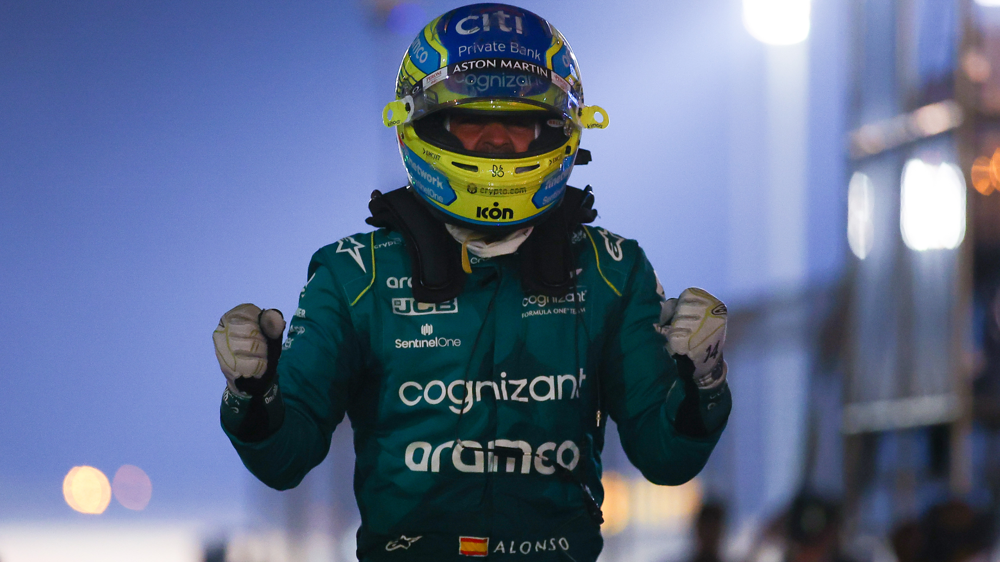
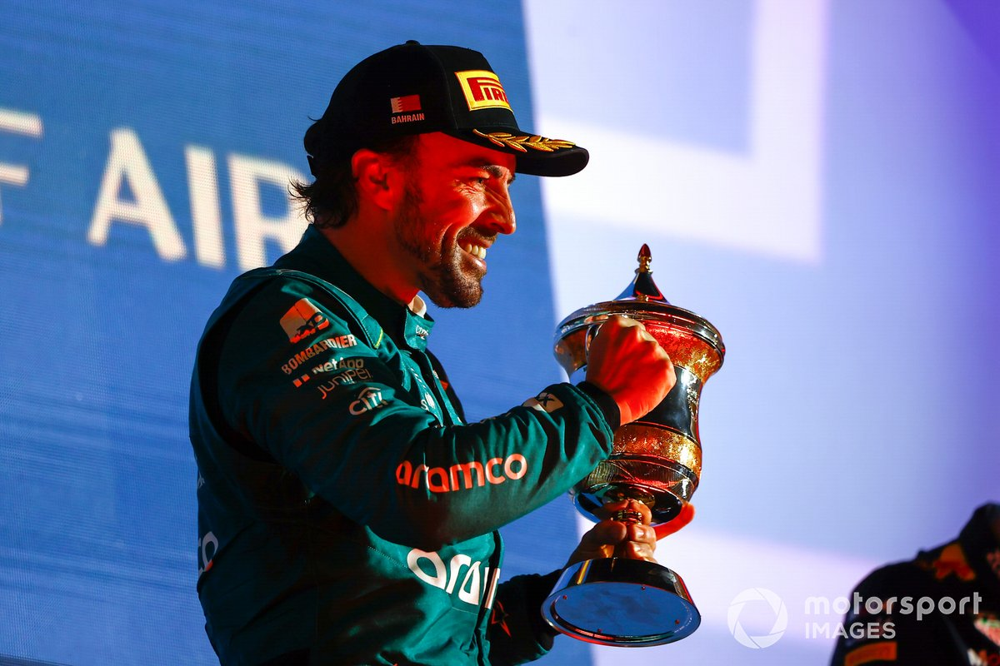

# *Ejercicio Markdown*
Este ejercicio está basado en el mejor piloto piloto de la historia de España
# **Fernando Alonso lográ su podio nº99**


[Info del NANO](https://es.wikipedia.org/wiki/Fernando_Alonso)

# **¿Logrará su victoria número 33?**



* [Noticia 1](https://es.motorsport.com/f1/news/fotos-podio-alonso-bahrein-formula1-2023/10440293/)
* [Noticia 2](https://www.marca.com/motor/formula1/2023/03/14/6410b0ff268e3e190e8b457d.html)
* [Noticia 3](https://www.marca.com/motor/formula1/gp-arabia-saudi/2023/03/14/6410a9a7ca47411c668b45c9.html)

### Logros del NANO


| **AÑO** |PODIUM|Carreras finalizadas|Carreras NO finalizadas |
|---|---|---|---|
|**2023**|2|2|0|
|**2022**|0|14|8|
|**2021**|1|20|2|
|**2020**|0 |0|0|

```
En 2021 no participó en Fórmula 1
```

```
Corrió en INDYCAR y las 24 Horas de LeMans
```

[Intalacion](instalacion.md)
[Informacion](informacion.md)
