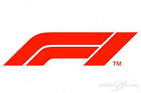

# FORMULA 1

El Campeonato Mundial de Fórmula 1 de la FIA, más conocido como Fórmula 1, F1 o Fórmula Uno, es la principal competición de automovilismo internacional y el campeonato de deportes de motor más popular y prestigioso del mundo. La entidad que la dirige es la Federación Internacional del Automóvil.

* [Wikipedia](https://es.wikipedia.org/wiki/F%C3%B3rmula_1)
* [Últimas noticias](https://www.marca.com/motor/formula1.html)
* [Canal de YouTube](https://www.youtube.com/@Formula1)
