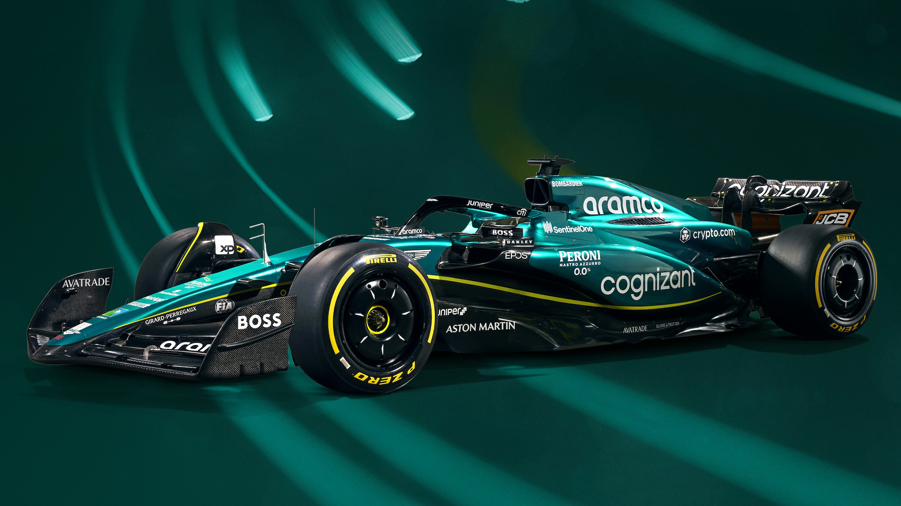

# **ASTON MARTIN ARAMCO COGNIZANT FORMULA ONE TEAM**

*Aston Martin* es una escudería británica de Fórmula 1 que a finales de 2020 regresó a la grilla, gracias a que Lawrence Stroll invirtió en Aston Martin £182 millones de libras, lo cual le proporcionó el 20% de las acciones del fabricante, con tal movimiento decide usar la imagen de Aston Martin para convertir a partir de 2021 al equipo Racing Point en Aston Martin F1 Team.1​2​ Actualmente tiene su base en Silverstone, Reino Unido.

* [Wikipedia](https://es.wikipedia.org/wiki/Aston_Martin_en_F%C3%B3rmula_1)
* [SoyMotor](https://soymotor.com/equipos/aston-martin)
* [Presentacion AMR23](https://youtu.be/qnIWMAJ7TCE)

[Instalacion](README.md)